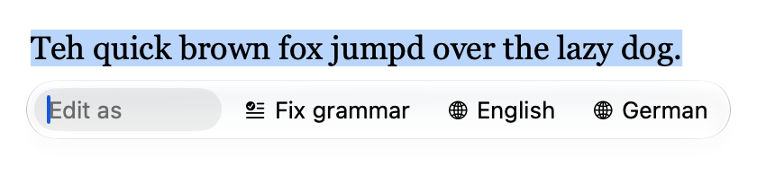
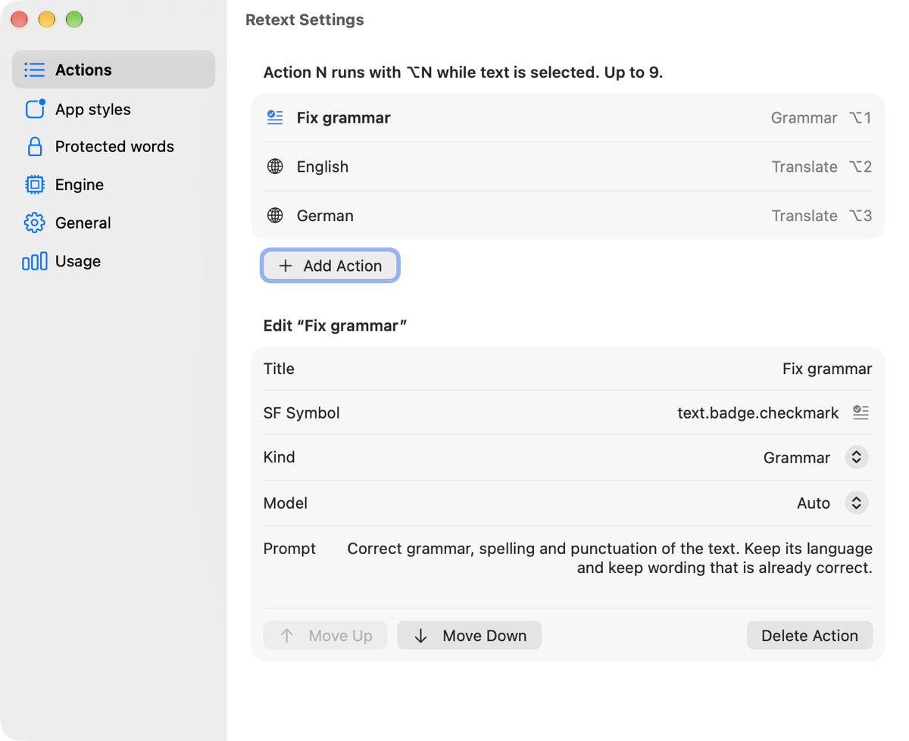

# Retext

**Fix grammar, translate and rewrite selected text in any macOS app, in place, with one shortcut.** A native SwiftUI menu-bar app with a Liquid Glass bar, powered by your own [Claude Code](https://code.claude.com/docs/en/overview) CLI.

[](https://github.com/hlebtkachenko/retext/actions/workflows/ci.yml)
[](https://github.com/hlebtkachenko/retext/releases)
[](LICENSE)
[](#requirements)
[](Package.swift)
[](#)
[](CONTRIBUTING.md)

Retext is a macOS menu-bar app for rewriting selected text in place. Select text in any app and press ⌥Space. A compact Liquid Glass bar opens under the selection, with an "Edit as" field and your action buttons. Type an instruction or pick an action. Retext sends the text to your installed [Claude Code](https://code.claude.com/docs/en/overview) CLI (`claude -p`) and pastes the result over the selection. The original font, size and colour are kept.



- **Actions:** Fix grammar and English, plus a translation into your Mac's language when that isn't English. You can edit them or add your own, up to 9. ⌥1…⌥9 run them directly while text is selected.
- **Free instructions:** type "shorter", "more formal" or "as a bullet list" into the bar and press Return.
- **App styles:** optional extra guidance for a given app, for example "formal" for Mail. None by default.
- **Protected words:** names and terms that are never changed or translated.
- **Model:** Claude Sonnet through the Claude Code `sonnet` alias. You can switch an action to Haiku (`haiku` alias).
- **Native output:** translations convey meaning rather than words, and Fix grammar also rewrites phrasing a native speaker wouldn't use. Grammar fixes and translations keep a one-line text on one line.
- **Read-only text** (web pages, PDFs, received mail): the result is copied to the clipboard instead of pasted.
- **Extras:** a "No changes needed" check, a cache of recent results, and a menu-bar menu with your actions, Recent results to copy and a daily usage summary.



## At a glance

| | |
| --- | --- |
| **What** | AI writing assistant for selected text: grammar and spelling fixes, translation, free-form rewrites ("shorter", "more formal") |
| **Where** | Any macOS app with selectable text: Mail, Notes, Pages, Safari, Slack, VS Code, Telegram and more; read-only text is copied instead |
| **How** | Select text, press ⌥Space (bar) or ⌥1…⌥9 (direct action); the result replaces the selection with its original formatting |
| **Engine** | Your installed Claude Code CLI (`claude -p`), Claude Sonnet (Haiku per action if you choose); no API key handling in the app |
| **Stack** | Swift 6, SwiftUI, Liquid Glass, AppKit, Accessibility API, CGEvent tap; no third-party dependencies |
| **Requires** | macOS 26+, Xcode 26+ to build, Claude Code logged in, Accessibility permission |
| **License** | Apache 2.0 |


## Requirements

- macOS 26 or later.
- Xcode 26 or later, to build.
- [Claude Code](https://code.claude.com/docs/en/overview), installed and logged in. Any recent version works; Retext was tested with 2.1.284. Retext looks for `claude` in your login shell's `PATH`, then in `~/.local/bin`, `/opt/homebrew/bin` and `/usr/local/bin`. You can also set the path in Settings → Engine.
- The Accessibility permission (System Settings → Privacy & Security → Accessibility). Retext needs it to read the selection and to see its shortcuts.

Retext uses your own Claude Code login: subscription usage counts against your plan's limits; API-key logins are billed to your account. The Usage pane shows the list-price equivalent of each call, as reported by `claude -p`.

## Build and install

```sh
git clone https://github.com/hlebtkachenko/retext.git
cd retext
./build.sh
```

`./build.sh` builds a release binary, signs `build/Retext.app`, copies it to `~/Applications/Retext.app` and starts it. `./build.sh --no-install` only builds.

Signing uses the first of these that is set:

1. the `RETEXT_SIGN_IDENTITY` environment variable;
2. a `.sign-identity` file in the repo root, holding one line with the name of a code-signing identity (the file is git-ignored);
3. ad-hoc signing (`-`).

To list your identities:

```sh
security find-identity -v -p codesigning
```

> [!WARNING]
> macOS ties the Accessibility grant to the app's signature. An ad-hoc build gets a new signature on every rebuild, so after each `./build.sh` you have to remove Retext from the Accessibility list and allow it again. Sign with a stable identity (a free Apple Development certificate from Xcode is enough) to keep the grant.

On first launch, allow Retext in System Settings → Privacy & Security → Accessibility. The shortcuts start working without a relaunch.

## Shortcuts

| Keys | What it does |
| --- | --- |
| ⌥Space | Opens the bar for the selected text, or closes it. You can switch to ⌃⌥Space in Settings → General. |
| ⌥1…⌥9 | Runs action 1…9 on the selected text, with or without the bar. They are taken only while text is selected, so layouts that type characters with ⌥digit keep working. |
| Return | Runs the typed instruction, or the highlighted action. |
| ← / → / Tab | Move between the field and the action buttons (← and → only while the field is empty). |
| Esc | Cancels a running request or closes the bar. |
| ⌘Z | Undoes a paste in the app as usual. After a "Copied" result (read-only text), ⌘Z within 4 seconds puts your previous clipboard back. |

## Privacy

- **What's sent:** the selected text, the action's prompt or your typed instruction, your protected words, and the style for the current app. They go to Claude Code, which sends them to Anthropic under your account. Retext calls nothing else.
- **History:** `~/Library/Application Support/Retext/history.json` keeps the last 20 results in plain text, including the original text. It powers the Recent menu and the cache. To clear it, use Settings → General → Clear History. To stop saving results, turn off "Keep history"; the cache is then off too. `usage.json` keeps only daily counts of calls, tokens and cost. `settings.json` holds your settings.
- **Clipboard:** to read a selection, Retext sends ⌘C and then restores your clipboard. To paste, it puts the result on the clipboard, sends ⌘V, and restores your previous clipboard about 0.7 seconds later. The pasted result and the restored items are marked `org.nspasteboard.TransientType`, so clipboard managers that follow the [nspasteboard.org](http://nspasteboard.org) markers skip them. Concealed items, such as passwords from a password manager, keep their `org.nspasteboard.ConcealedType` marker. For read-only text, the result stays on the clipboard.


## Known conflicts

- **⌥Space:** Retext always takes ⌥Space, before other apps' hotkeys for the same combo. On some keyboard layouts ⌥Space types a non-breaking space, and some launchers use it too. If that matters to you, switch to ⌃⌥Space in Settings → General. macOS can use ⌃⌥Space for "Select next source in Input menu" (System Settings → Keyboard → Keyboard Shortcuts → Input Sources); Retext takes it first, so turn that shortcut off if you rely on it.
- **Menu-bar icon:** on a Mac with a notch, a crowded menu bar can hide the icon behind it. Turn off Settings → General → "Show in menu bar" to drop it; the shortcuts keep working, and opening Retext again from Spotlight or Finder brings up Settings.
- **Electron apps** (Slack, VS Code, Claude and others) build their accessibility tree only when asked. With "Improve Electron app support" on (the default), Retext asks every app you switch to, so ⌥1…⌥9 work there right away. Turn it off to ask only when you use a shortcut; the first ⌥N in such an app may then pass through. Electron and web apps often report no selection position, so the bar opens under the text field or at the mouse pointer.

## Uninstall

1. If "Open at login" is on, turn it off in Settings → General. Then quit Retext from its menu.
2. Delete `~/Applications/Retext.app`.
3. Delete `~/Library/Application Support/Retext` to remove settings, history and usage.
4. Remove Retext from System Settings → Privacy & Security → Accessibility, or run:

   ```sh
   tccutil reset Accessibility co.hleb.retext
   ```

## How it compares

- **Apple Writing Tools:** built in and on-device, but limited to Apple Intelligence languages and regions, with a fixed set of actions. Retext works in any language Claude handles, with your own actions, protected words and per-app styles.
- **Grammarly and similar services:** separate accounts and subscriptions. Retext is a small open-source app that reuses the Claude Code login you already have and adds nothing to your pages.
- **Launcher AI commands (Raycast, Alfred):** broad and powerful, with AI features usually on a paid plan. Retext does one job: rewrite the selection in place, keeping font, size and colour.

## FAQ

**Does it work offline?** No. Every request goes through Claude Code to Anthropic. Results you've seen recently are served from the local cache.

**Does it cost anything?** The app is free. Requests count against your Claude plan's limits, or are billed to your API account if Claude Code uses an API key.

**Which languages?** Any language Claude handles. The default third action translates into your Mac's language when that isn't English.

**Why the Accessibility permission?** To read the selection, find where to show the bar, catch the shortcuts and paste the result. Retext doesn't record keystrokes; the event tap only reacts to its own shortcuts.

**Can I use another model or provider?** Retext calls `claude -p` with the `haiku` and `sonnet` aliases, so whatever your Claude Code is configured for applies. You can pick the model per action.

## Contributing

Issues and pull requests are welcome; see [CONTRIBUTING.md](CONTRIBUTING.md). For a larger change, open an issue first. Changes are listed in [CHANGELOG.md](CHANGELOG.md).

- Build with `swift build`, test with `swift test`. Both must pass. `RetextCore` holds the testable logic, with tests in `Tests/RetextCoreTests` (Swift Testing).
- To check UI changes without a selection, run `build/Retext.app/Contents/MacOS/Retext --demo menu` or `--demo settings general`. See [AGENTS.md](AGENTS.md) for all demo states.
- [ARCHITECTURE.md](ARCHITECTURE.md) describes the flow from shortcut to paste, and the decisions behind it.
- Keep the app dependency-free. Use [Conventional Commits](https://www.conventionalcommits.org) for commit messages.
- To report a security issue, see [SECURITY.md](SECURITY.md).

## License

[Apache License 2.0](LICENSE).

Retext calls your installed Claude Code CLI with your own login and never reads or stores credentials. Not affiliated with or endorsed by Anthropic. Claude and Claude Code are trademarks of Anthropic.
